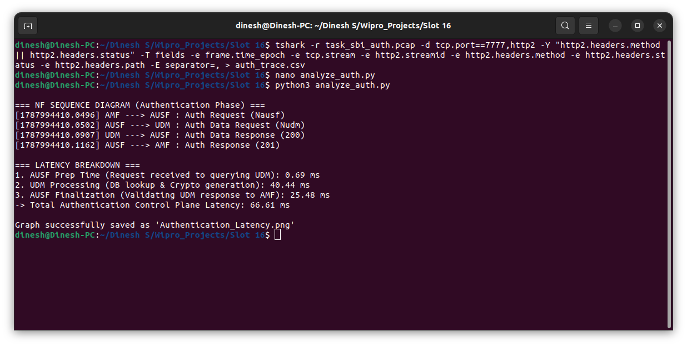
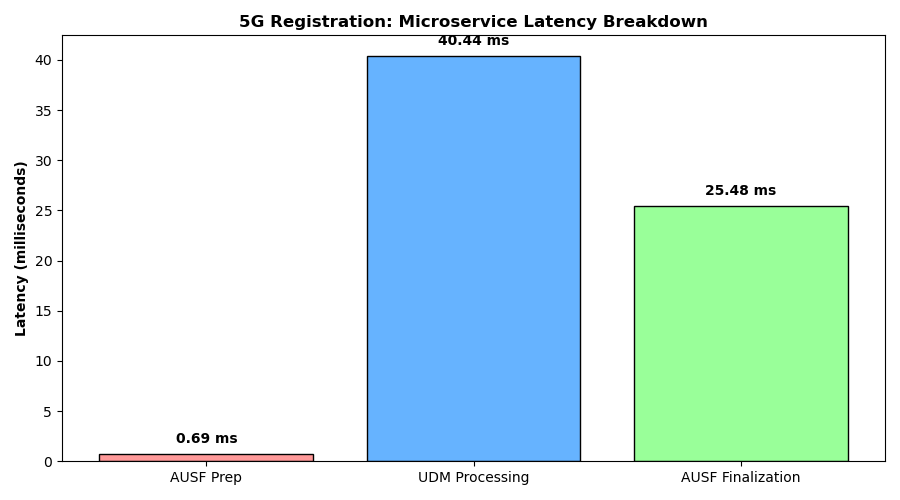

# 5G Core SBI Call-Flow Tracing & Authentication Latency Analysis

A network engineering project analyzing 5G Standalone (SA) control-plane traffic. This repository traces the User Equipment (UE) authentication sequence across the **AMF, AUSF, and UDM** Network Functions over the HTTP/2 Service-Based Interface (SBI).

---

## Theoretical Concept: 5G Registration

When a 5G phone (UE) initiates a Registration Request, the Access and Mobility Management Function (AMF) receives the signal but lacks cryptographic verification capabilities. The AMF relies on the SBI to authenticate the subscriber via a chain of HTTP/2 microservice calls:

1. **AMF $\rightarrow$ AUSF (`Nausf`):** The AMF issues an HTTP `POST` requesting subscriber verification.
2. **AUSF $\rightarrow$ UDM (`Nudm`):** The Authentication Server Function (AUSF) manages the protocol but forwards the request to the Unified Data Management (UDM) to retrieve the cryptographic secrets.
3. **UDM Processing:** The UDM queries the UDR (MongoDB), generates Authentication Vectors (Milenage/TUAK algorithms), and returns an HTTP `201 Created` response.
4. **AUSF $\rightarrow$ AMF:** The vectors are passed back to the AMF, which challenges the UE over the radio interface.

### Real-World Analogy
- **AMF (Receptionist):** Greets the user but cannot issue a secure badge.
- **AUSF (Security Manager):** Enforces protocol but lacks access to the employee files.
- **UDM (Secure Vault):** Looks up the file, prints the secure ID badge, and passes it back up the chain.

---
### Technology Stack: 
* Open5GS
* UERANSIM
* Wireshark / TShark
* HTTP/2
* Python
* Pandas
* Matplotlib
* PCAP packet captures


---

## Prerequisites & Initial Setup

This simulation runs on Ubuntu 22.04 LTS utilizing **Open5GS** and **UERANSIM**.

1. **Install Core Dependencies:** Ensure TShark, Python 3, Pandas, and Matplotlib are installed.
   ```bash
   sudo apt install tshark python3-pip
   pip3 install pandas matplotlib
   ```
2. **Prepare the Database & Network Interface:** Ensure MongoDB is running cleanly and the UPF TUN device is active.
   ```bash
   sudo systemctl restart mongod
   sudo ip tuntap add name ogstun mode tun
   sudo ip addr add 10.45.0.1/16 dev ogstun
   sudo ip link set ogstun up
   ```
3. **Add Subscriber:** Access the Open5GS WebUI (`http://localhost:3000`) and verify IMSI `999700000000001` exists with valid security credentials (OPc/K). Delete and recreate the subscriber if a cached security context already exists to force a fresh authentication challenge.

---

## Execution Procedure

### 1. Launch the 5G Core Network
Start all Open5GS Network Functions in the background.
```bash
./install/bin/open5gs-nrfd &
./install/bin/open5gs-scpd &
./install/bin/open5gs-smfd &
./install/bin/open5gs-amfd &
./install/bin/open5gs-ausfd &
./install/bin/open5gs-udmd &
./install/bin/open5gs-udrd &
./install/bin/open5gs-pcfd &
./install/bin/open5gs-upfd &
```

### 2. Start HTTP/2 Packet Capture
Capture all TCP traffic on port `7777` (default Open5GS SBI port) on the loopback interface before starting the UE.
```bash
tshark -i lo -f "tcp port 7777" -w data/task_sbi_auth.pcap
```

### 3. Boot Radio Access Network (RAN) & UE
Start the gNodeB and the UE to trigger the registration payload.
```bash
./nr-gnb -c ../config/open5gs-gnb.yaml &
sleep 3
sudo ./nr-ue -c ../config/open5gs-ue.yaml
```

### 4. Extract API Metadata
Stop the TShark capture (`Ctrl+C`). Decode the `.pcap` as HTTP/2, filtering specifically for `nausf` and `nudm` methods, and extract the timestamps into a CSV.
```bash
tshark -r data/task_sbi_auth.pcap -d tcp.port==7777,http2 -Y "http2.headers.method || http2.headers.status" -T fields -e frame.time_epoch -e tcp.stream -e http2.streamid -e http2.headers.method -e http2.headers.status -e http2.headers.path -E separator=, > data/auth_trace.csv
```

### 5. Run Python Latency Analysis
Execute the included data pipeline to trace the sequence and plot the delays.
```bash
python3 src/analyze_auth.py
```

---

## Results & Artifacts

The analysis script parses the captured HTTP/2 streams and outputs a dynamic NF Sequence Diagram alongside a calculated latency breakdown.

### Terminal Output


### Microservice Latency Visualization
The Python script correlates the request/response timestamps to generate a visual latency breakdown. The longest latency block typically occurs during the UDM Processing phase, accounting for the execution of cryptographic algorithms and MongoDB lookups.



---

### References

* 3GPP TS 23.501: System Architecture for the 5G System; Stage 2 (Release 17).
* 3GPP TS 23.502: Procedures for the 5G System (Section 4.2.2: Registration Management).
* 3GPP TS 29.509: 5G System; Authentication Server Services (Nausf); Stage 3.
* 3GPP TS 29.503: 5G System; Unified Data Management Services (Nudm); Stage 3.
* Literature: Rommer, S., et al. (2019). 5G Core Networks: Powering Digitalization. Academic Press.
* Documentation: Open5GS Core Network Deployment Guidelines (Official Documentation, 2024).
* Documentation: Wireshark & TShark Network Protocol Analyzer User Guide (HTTP/2 Dissection parameters).

---

### Done by

**Name:** Dinesh S

**College Reg. No:** 2117230040031

**Degree & Year of Study:** B.E Electronics and Communication Engineering, Final Year

**College Name:** Rajalakshmi Institute of Technology, Chennai.
